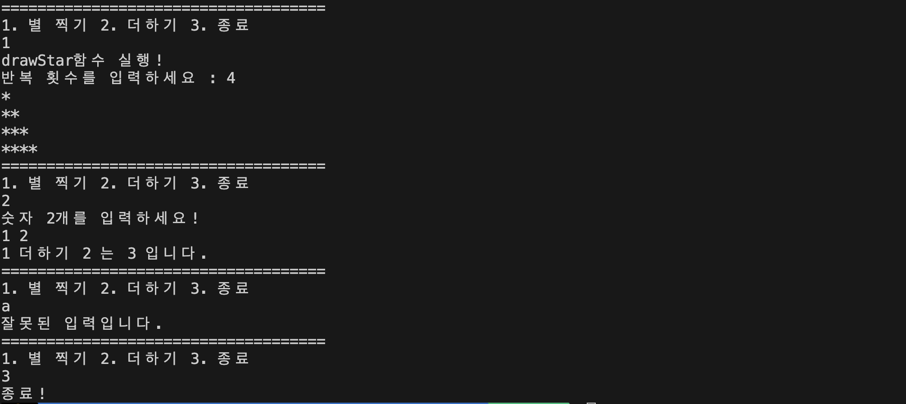
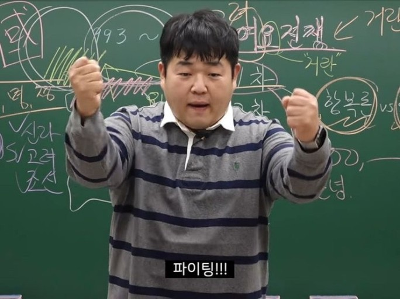

# C++_Basic_Week_02

_작성자 : 황선웅_

>_이번 주는 과제로 대체하겠습니다._

---
### 함수

잘 아시듯, 프로그램의 규모가 커질수록, `main()` 함수에 모든 코드를 담기는 어려워집니다. 프로그램의 가독성을 높이기 위해선 **함수 단위로 간결하게 나눠서 작성해야합니다.**

C++에서 함수를 사용하려면 **반드시 사용하려는 위치보다 앞에서 선언해야 합니다.**   
1. 특정한 파일 안에서만 사용할 함수
    + 함수의 선언과 구현( 정의 )를 모두 소스 파일 안에 작성
<br><br>

2. 다른 모듈이나 파일에서도 사용해야하는 함수
   + 함수의 선언은 헤더 파일에 작성하고 구현은 소스파일에 작성
<br><br>

> 함수를 **선언**하는 문장은 **함수 프로토타입, 함수 원형, 함수 헤더**라고도 부릅니다. 함수의 구체적인 내용은 보지 않고, 그 함수에 접근하는 방식만 표현한다는 의미가 강합니다. 함수의 리턴 타입을 제외한 함수 이름과 매개변수 목록을 **함수 시그니처**라고 부릅니다.

<p align="center">
<br>뭔소리야...</img>
</p>

코드로 살펴보겠습니다!

**함수 선언** _( aka 함수 프로토타입, 원형, 헤더 )현
```cpp
void myFunction( int i, char c ) ;
```
C언어와 동일하게 위는 리턴값이 없고, `int`, `char` 타입의 매개변수가 있는 함수 `myFunction` 함수를 선언하는 코드입니다. 다들 아시죠?

하지만 위 코드 한줄만 컴파일 하면, 실제로 코드에는 존재하지 않는 함수를 호출하기 때문에 링크 과정에서 에러가 발생합니다.

**함수 구현** _( aka 함수 정의 )_
```cpp
void myFunction( int i, char c )
{
    std::cout << "the value of i is" << i << std::endl ;
    std::cout << "the value of c is" << c << std::endl ;
}
```
위 같이 함수가 어떤 동작을 하는지 정의하면, 정상적으로 컴파일이 되겠죠? 그럼 이 함수를 어떻게 가져다 쓰느냐...

**함수 호출**
```cpp
myFunction( 8, 'a' ) ;
myFunction( someInt, 'b' ) ;
myFunction( 5, someChar ) ;
```
인수 2개를 지정하여, `myFunction()`을 호출할 수 있습니다.

```cpp
int add( int a, int b )
{   
    return a + b ;
}
```
당연히, 리턴값도 지정해줄수 있습니다.

**C++의 함수 기능들**

<p align="center">
<br>C++의 턱별한 기능들을 알려 드리겠습니다...</img>
</p>

1. **함수 리턴 타입 추론**   
   C++부터는 함수의 리턴 타입을 컴파일러가 알아서 지정할 수 있습니다!!! 
   ```cpp
   auto addNumbers( int num1, int num2 )
   {
    return num1, num2 ;
   }
   ```
   `auto`키워드를 사용하면 되는데요. 이때 컴파일러는 표현식의 타입에 따라 리턴 타입을 추론합니다. 함수 안에는 `return`문이 여러 개가 있을 수 있는데, 각 **타입은 모두 같아야 합니다.** 

2. **현재 함수 이름** 
   ```cpp
	auto addNumbers( int num1, int num2 )
   {
		std::cout << "Entering function" << __func__ << std::endl ;
   	return num1, num2 ;
   } 
   ```
	C와 동일하게, 함수마다 내부적으로 `__func__`라는 로컬 변수가 정의되어 있습니다. ( `__LINE__`으로 현재 몇번째 라인인지, `__FILE__`로 파일 경로도 알 수 있습니다. )

<br>

---
### 과제

C++ 기본 출력과 함수와 관련 된 간단한 구현입니다.
`week.hpp`에 `week02::drawStar()` 함수와 `week02::add()` 함수가 선언되어 있으며,`main.cpp` 에서 이를 `include`하고 정의합니다. 

파일들은 `/assignment/week02`에도 있습니다.

<details>
<summary>과제 코드들</summary>
<div markdown="1">       

```cpp
// week02.hpp
#include<iostream>

namespace week02{

	void drawStar();
	int add( int a, int b );
	
}
```

```cpp
// main.cpp
#include "week02.hpp"

void week02::drawStar( )
{
	// 사용자로부터 반복 횟수를 입력받아서 해당 횟수만큼 별이 찍힌 라인을 출력합니다.
	// 각 줄마다 별의 개수는 1개씩 늘어납니다.
	// 작성은 아래 코드 영역에 작성해 주세요
	// !! 함수가 호출 되었을때, __func__를 이용해 "drawStar함수 호출!" 이라는 문장이 출력되게 해주세요 !!
	/*
		코드
		.
		.
		.
	*/
}

// 인자로 전달된 2개의 int 형태의 값을 더한 값을 반환하는 함수 add를 작성해 주세요.
// add 함수는 week02 네임스페이스에 정의되어 있습니다.
/*
	코드
	.
	.
	.
*/

int main()
{
	int choice = 0 ;

	while ( true )
	{
		std::cout << "====================================" << std::endl;	
		std::cout << "1. 별 찍기" 
					<< " 2. 더하기" 
						<< " 3. 종료" << std::endl;

		// switch 문을 사용해서 choice 변수의 값에 따라 원하는 기능이 동작하도록 구현해주세요
		// 1, 2, 3이 아닌 다른 입력이 들어오면, 잘못된 입력이란 문장을 출력하고 다시 입력하도록 구현해 주세요.
		// 1번 : 별 찍기, 2번 : 더하기, 3번 : 프로그램 종료
		// !! 문자가 입력되어도 다시 입력하도록 구현해 주세요 !!
		/*
			코드
			.
			.
		*/
	}

	return 0;
}
```
<p align="center">
<br>출력 예시</img>
</p>

</div>
</details>

<br>
다음 스터디 시간에 확인 하겠습니다!
<br>
<br>

<p align="center">
</img>
</p>