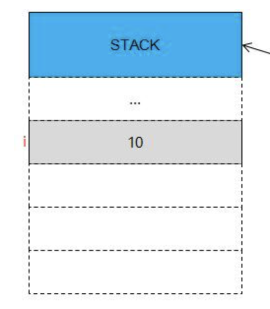
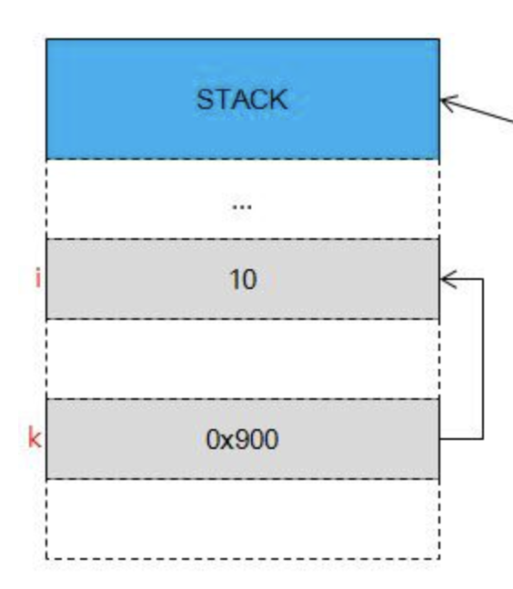
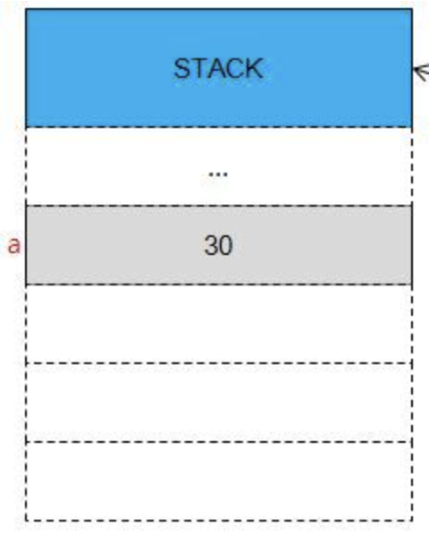
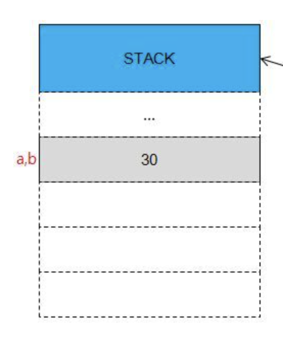

# C++_Basic_Week_03

_작성자 : 황선웅_

> 오늘은 C++의 꽃 참조자에 대해 배워보겠습니다.

---

<br>

<p align="center">
</img>
</p>

안녕하세요? 날씨가 엄청 춥네요.<br>
TMI인데 아리아나그란데 신곡 좋더라구요 반복 재생 중입니다..

시작하죠
<br>

### 참조자
앞서 말했다시피, 오늘은 **참조자**에 대해 알아볼건데요. **참조자**가 뭐냐!
```cpp
#include <iostream>

int change(int *p) 
{
  *p = 3;

  return 0;
}

int main() 
{
  int num = 5;

  std::cout << num << std::endl;
  change( &num );
  std::cout << num << std::endl;
}
```
<br>

위 코드에선 
1. `change()` 함수에 `num`의 주소값을 전달하고
2. `change()`함수에서 `*p`를 이용해 `num`을 참조하여 값을 3으로 변경 
   
하였습니다.

C언어에선 위 코드처럼 어떠한 변수를 가리키고 싶을 땐 반드시 포인터를 사용해야만 했습니다. 하지만! C++에선 변수나 상수를 가리키는 방법으로 또 다른 방식을 사용하는데, 이를 **참조자(레퍼런스 - reference)** 라고 부릅니다.

아래 코드를 보시죠
```cpp
#include <iostream>

int main() 
{
  int num = 3;
  int& ref_num = num;

  anot = 5;
  std::cout << "num : " << num << std::endl;
  std::cout << "ref_num : " << ref_num << std::endl;
}
```
변수의 참조자를 정의하고, 출력해보는 코드입니다.

```cpp
int& ref_num = a;
```

`int num`의 참조자 `ref_num`을 정의하는 부분입니다.
보이는 것 처럼, 자료형 뒤에 **&** 를 붙이면 해당 자료형의 **참조자**를 정의할 수 있습니다.

<br>

<p align="center">
</img>
<br>포인터도 헷갈려 죽겠는데 무슨 참조자 참조형이야..
</p>

---

#### 포인터랑 다르다!

포인터는 변수의 값이 저장된 주소값을 가리키는 변수를 말하잖아요?

```cpp
int i = 10;
int* k = &i ;
```
<p align="center">
</img>
</img>
</p>

10이라는 값이 저장되어있는 주소값을 `0x900`이라고 가정한다면, 위와 같이 **포인터 변수인 k** 는 `0x900`이라는 값을 저장하게 됩니다.

하! 지! 만!
변수 `a`에 대한 참조자 `b`를 정의하면
```cpp
int a = 30;
int& b = a ;
```
<p align="center">
</img>
</img>
</p>

따로 공간이 할당 되지않고, 해당 주소 영역을 부르는 또 다른 이름이 생기게 됩니다.

[하지만, 항상 메모리 상에 존재하지 않는 것은 아닙니다.](https://junstar92.tistory.com/111)

이해가 되셨을까요?

---

#### 근데 참조형 왜 쓰는데?

참조형을 쓰면 여러 장점이 있습니다. 주로 객체지향 프로그래밍과 깊은 관련이 있는데, 자세한 사항은 아래 블로그들을 참고 부탁드립니다.

[C++의 참조](https://plas.tistory.com/56)

[참조자(Reference)의 개념과 함수 활용](https://easycoding91.tistory.com/entry/C-%EA%B0%95%EC%A2%8C-%EC%B0%B8%EC%A1%B0%EC%9E%90Reference%EC%9D%98-%EA%B0%9C%EB%85%90%EA%B3%BC-%ED%95%A8%EC%88%98-%ED%99%9C%EC%9A%A9)

간단하게 요약하자면

1. 복사본이 만들어지지 않는다. ( 큰 값도 쉽게 다룰수 있다... )
2. 매개변수 전달, 반환에 용이하다.
3. 구조체와 같은 중첩된 데이터에 쉽게 접근이 가능하다...

정도가 되겠습니다.

---

#### 참조자 쓸 때 주의해야 할 점!

참조자를 쓸 떈 생각보다 신경쓸게 많습니다...

1. **참조형 변수는 선언과 동시에 초기화 해줘야 한다.**
   
    ```cpp
    int& a ;
    ```
    위 코드는 정상적으로 컴파일 될까요?   
    `error: ‘a’ declared as reference but not initialized` 오류와 함께 컴파일이 되지 않습니다. 포인터와는 다르게 메모리 공간에 할당되지 않기 떄문에 꼭 선언과 동시에 초기화해 주셔야 합니다.

2. **참조 대상 변경이 불가능하다.**

    ```cpp
    double a = 10 ; 
    double b = 10 ; 
    
    double& ref_doub = a ;
    
    ref_doub = b ; 
    ```
    위 코드에서 `ref_doub = b ;` 는 `a = b`와 동일한 의미를 가집니다.   
    `a`의 값은 변경되어도, `ref_doub`가 참조하는 대상 변경 할 수 없습니다.

3. **상수 참조는 `const`를 사용해야 한다.**
    
    원래 비-상수 참조자(non-const reference)는 상수를 참조할 수 없지만 const를 사용하면 가능합니다.
    ```cpp
    const int num = 10;    // 상수int& 
    ref1 = num;       // Compile Error: 비-상수 참조자로 상수 참조 불가
    const int& ref2 = num; // Pass
    const int& ref3 = 100; // Pass
    ```
    또한 `const int& ref3 = 100`처럼 리터럴 상수도 참조할 수 있습니다. 여기서 100이라는 리터럴 상수는 임시적인 값으로써 메모리에 이름도 없이 존재 했다가 다음 행에서 소멸하는 것을 말합니다. 때문에 non-const 참조자는 상수를 참조할 수 없습니다. 메모리에서 이름도 없이 바로 사라지는 임시 값이니까요.

4. **NULL 값은 참조가 불가능하다.**

---

#### 함수에서의 참조자 사용

```cpp
int& add( int& a , int& b )
{
    int sum = a + b;
    // int& ret_val = sum;

    return sum ;
}
```

함수에선 위와 같이 매개변수로 참조자를 위와 같이 사용할 수 있습니다.   

위 함수 안에서 `a = 10 ;`과 같이 매개변수의 값에 접근한다면 어떻게 될까요?

매개변수로 전달된 원래 변수의 값을 변경할 수 있겠죠?

```cpp
int add( int a , int b )
{
    a = 10 ; 
    return a + b ;
}
```
그럼 이렇게 하면 어떻게 될까요?

원래 변수의 값은 바뀌지 않고, 함수에서 정의 된 `a`의 값만 변경됩니다.

이를 **call by reference**와 **call by value**의 차이라고 할 수 있습니다.

- **call by reference**는 함수 호출시 인수로 전달되는 **변수의 참조값**을 전달하는 방식입니다.

- **call by value**는 함수가 인수로 **전달받은 값**을 복사하여 처리하는 방식입니다.

---

### 생각해봅시다

아래 코드들의 출력을 생각해봅시다..

```cpp
int a = 10 ;

int& b = a ;
int &c = a ;
int* d = &a ;

std::cout << b << std::endl ;
std::cout << c << std::endl ;
std::cout << d << std::endl ;
std::cout << &d << std::endl ;
```

[oop 개요 노마드 코더](https://youtu.be/IeLWSKq0xIQ?si=-kcxfFBzm68kQ5a0)