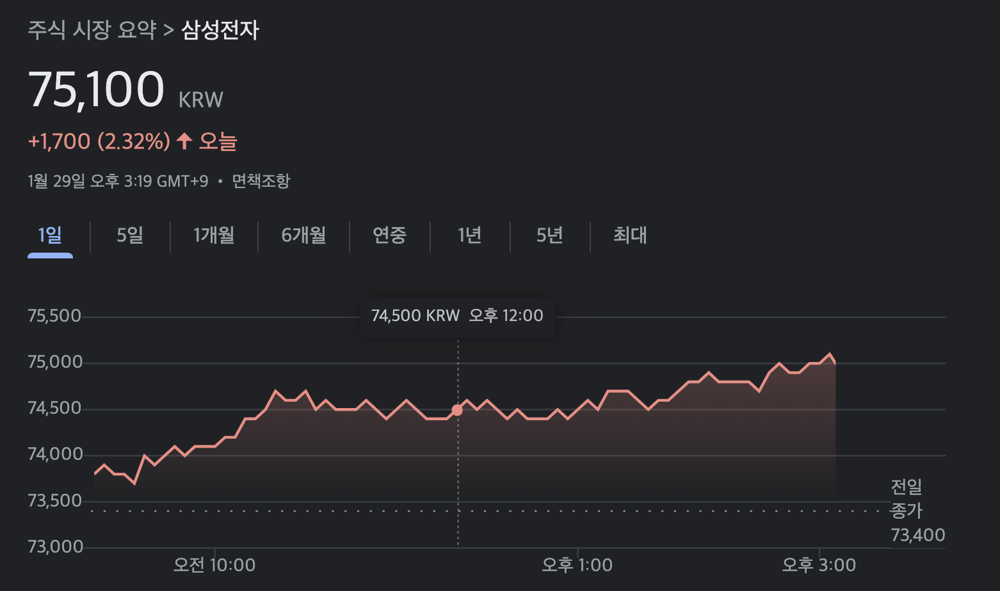
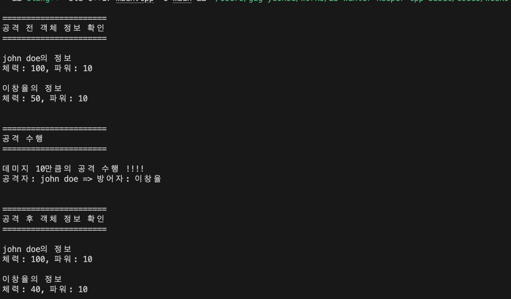

# C++_Basic_Week_04

_작성자 : 황선웅_

> 객체지향에 대해 조금씩 배워 나가봅시다.

---

<br>

안녕하세요?     
24년 1월이 벌써 다 갔네요. 제가 삼성전자를 7만7천원에 샀는데 거의 다 복구했어요. S24 많이 사주세요.

<p align="center">
</img>
<br>유후
</p>

오늘은 이전 시간에 배웠던 클래스부터 다시 시작해봅시다.

---

### 클래스와 구조체

저는 **클래스**가 객체지향의 개념에서 가장 기본이라고 생각합니다.   
**구조체** 의 엄청난 업그레이드 버전이라고 이해하면 쉬울 것 같아요. 

```c
// C의 구조체
struct Human {
  char *name ;
  int age ;
}; 
```
**C언어에서 구조체** 는 위와 같이 사용 했는데요. **C++** 에서도 거의 동일하게 **구조체**를 사용할 수 있습니다.

```cpp
// C++의 구조체
struct Human {
  char *name ;
  int age ;

  // 갑자기 함수가?
  void show() ;
};
```
다 똑같은데 **C++** 에는 함수가 하나 들어있죠?   
기존에 **C**에선 허용하지 않았지만 **C++** 에선 구조체 내에 함수를 선언하는 것이 가능합니다.

---
#### 실습해보기

위와 동일한 구조를 가진 `Human` 본인의 이름과 나이를 저장하는 객체를 만들고, `show()`를 이용해 출력하는 코드를 짜봅시다.

<p align="center">
</img>
<br>실행 결과
</p>


---
<br>

또 다른 기능으로, **C++ 구조체** 에서는 **접근 제어 지시자** 라는게 있습니다. 

```cpp
// C++의 구조체
struct Human {
private:
  char *name ;
  int age ;

public:
  void show() ;

};
```
말 그대로 구조체에 대한 **접근을 제어** 하는 역할입니다. 종류는 아래 3가지입니다.

>public : 어디서나 접근이 가능합니다.    
private : 구조체 내부가 아닌 다른 곳에선 접근이 불가능합니다.    
protected: 외부에선 접근이 불가능하나, 상속된 다른 클래스에서 접근이 가능합니다.

그럼 위에서 실습했던 코드를 조금 수정해봅시다!
  + 멤버 변수 `name`, `age` 를 `private`으로 지정
   
정상적으로 실행이 될까요?
<p align="center">
</img>
<br>안되는게 맞습니다...
</p>

---

### 클래스

C 구조체랑 C++ 구조체랑 차이점은 조금 아시겠나요?   
그럼 **클래스** 개념은 어렵지 않습니다. **struct** 를 **class** 로 바꿔주면 됩니다.

```cpp
class Human
{
  public:
    // 멤버 함수 
    char* GetName() const { return m_name ; }
    int GetAge() const { return m_age ; }

    // 생성자
    Human( char* t_name, int t_age ) : m_name( t_name ), m_age( t_age ) {}

    // 소멸자
    ~Human() {}

  private:
    // 멤버 변수
    char* m_name ;
    int m_age ;
};
```

[객체지향 개념 영상](https://youtu.be/FTgU7fET0J4?feature=shared)

---

### 생성자

**객체를 생성** 하는 **멤버 함수**.    
클래스와 이름이 같은 멤버 함수로 **객체의 생성과 초기화** 를 한번에 할 수 있습니다. 위의 `Human` 객체의 생성자를 살펴봅시다.

```cpp
Human::Human( char* t_name, int t_age )
{
  m_name = t_name ;
  m_age = t_age ;
}
```
위 코드는 아래와 같이 한줄로 줄일수도 있습니다.
```cpp
Human( char* t_name, int t_age ) : m_name( t_name ), m_age( t_age ) {}
```

또 생성자는 **오버로딩** 이 가능한데요
```cpp
Human() {};
Human( int t_age ) : m_age( t_age ) {}
Human( char* t_name, int t_age ) : m_name( t_name ), m_age( t_age ) {}
```
위와 같이 **동일한 이름** 의 함수지만, 매개변수나 반환 값을 다르게 해 서로 적절하게 다른 기능을 구현하는 것을 **함수 오버로딩** 이라고 합니다. 

<p align="center">
</img>
<br>거의 다 왔습니다...
</p>

```cpp
Human two = one ;
```

저희가 만든 `Human` 클래스의 객체를 사용하는 위 코드는 작동이 될까요?   

---

#### 실습해보기

위 `human` 클래스의 생성자를 정의하고, 동일한 동작을 수행하는 코드를 짜주세요. 


---

#### 과제

아주 간단한 게임 코드 완성 과제 드리겠습니다!    

`week04.hpp`에는 `week04` 네임스페이스 안에 `Human` 클래스가 정의되어 있습니다.   

`Human` 클래스는 총 3가지 **멤버 변수** 를 가지고 있습니다.

1. 이름을 뜻하는 `m_name`
2. 체력인 `m_hp`
3. 공격시 데미지인 `m_power`.


`Human` 클래스는 총 4가지 **멤버 함수** 를 가지고 있습니다.

1. `Attack`
  + **call by reference** 방식으로 방어자를 매개변수로 받는다.
  + 얼만큼 데미지가 들어가는지, 공격자와 방어자가 누군지 출력한다.
  + 방어자의 `m_hp`를 공격자의 `m_power` 만큼 체력을 깎는다.

2. `GetInfo`
  + 객체의 정보를 출력한다. (`m_name`, `m_hp`, `m_power`)
  
3. 기본 생성자
  + 매개변수를 받지 않는 생성자

4. 일반 생성자
  + (`m_name`, `m_hp`, `m_power`)를 매개변수로 받는 생성자.

##### 주의해야 할 점
+ 멤버 함수들은 `public`, 멤버 변수들은 `private` 으로 구현해 주세요.
+ `GetInfo` 는 객체 생성 없이 실행이 가능한 독립적인 함수입니다. 

실행결과는 아래와 같습니다.  
검사는 다음 스터디 시간에 하겠습니다. 궁금한 거 있으면 뭐든지 물어봐 주세요!

<p align="center">
</img>
<br>화이팅!
</p>