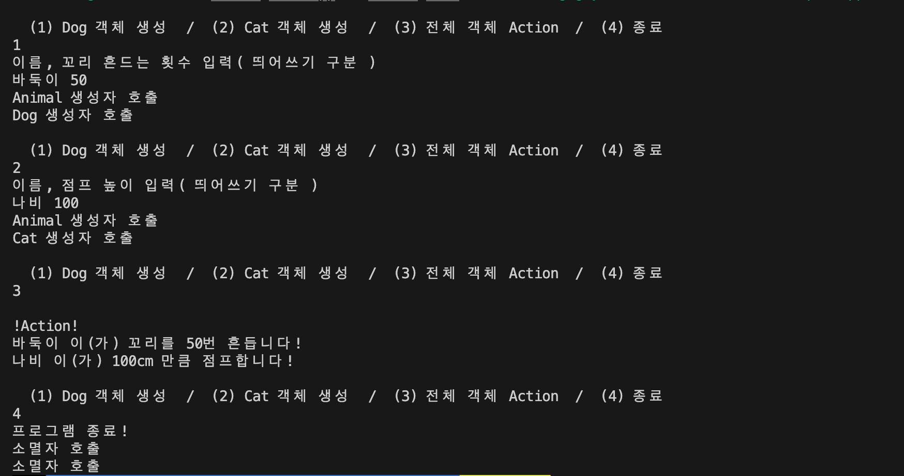

# C++_Basic_Week_06

_작성자 : 황선웅_

> 상속은 뭘까요?

---

<br>

안녕하세요 여러분 수강신청은 잘 하셨나요?   
여러분들은 저처럼 4학년에 시간표짠다고 고생하시지 마시고, 미리미리 졸업요건표 보시고 계획 세워두시길 바랍니다...   

<!-- 

--- -->

<p align="center">
</img>
<br>미리... 미리!!!!
</p>

지난 주 과제부터 리뷰하고 넘어가겠습니다.   

## 과제 리뷰

### 1. 헤더 파일

**`#include<iostream>`은 한번만 적어도 됩니다.**
 
 `#include "week04.hpp"`는 전처리 과정에서 처리되는 구문입니다. 컴파일 과정에서 처리되는데, `week04.hpp` 파일의 내용을 모두 해당 파일에 붙여넣기합니다.

```cpp
// week04.hpp
#include <iostream>
```

```cpp
// week04_main.cpp
#include "week04.hpp"
```
만약 `week04.hpp`에 표준 입출력 라이브러리 `iostream`의 내용이 모두 복사 붙여넣기 됩니다. 그럼 `week04_main.cpp`에는 `#include <iostream>` 을 생략해도 `iostream` 라이브러리를 사용 할 수 있습니다. 👍

### 2. Static

과제에서 말씀드린 **객체 생성 없이 실행이 가능한 독립적인 함수 `GetInfo` 는** `static` 키워드를 사용하시면 구현이 가능합니다. `static`으로 선언 된 멤버 함수나 멤버 변수는 현재 객체를 가리키는 `this`라는 키워드와 바인딩되지 않는데, 이는 독립적으로 해당 멤버 함수, 멤버 변수를 사용할 수 있게 합니다. ( 자세한 내용은 추후 다루겠습니다. )

<details>
<summary>04주차 과제 답안 예시</summary>
<div markdown="1">

week04.hpp

```cpp
#include <iostream>
#include <string>

namespace week04
{
	class Human
	{
		// 멤버 변수 ( m_name, m_hp, m_power )
        private:
        std::string m_name = "John Doe" ;
        int m_hp = 100 ;
        int m_power = 10 ;
        
		// 멤버 함수 ( Attack, GetInfo )
        public:
        void Attack( Human& defender ) ;
        static void GetInfo( Human t_human ) ;

		// 생성자 ( 매개변수 없는 디폴트 생성자, 매개변수 m_name, m_hp, m_power인 생성자 )
        Human() ;
        Human( std::string t_name, int t_hp,int t_power ) ;
	} ;
}
```

week04_main.cpp

```cpp
#include "week04.hpp"

/////// Human 클래스의 생성자 정의 ( 매개변수가 없는 생성자, 매개변수 m_name, m_hp, m_power인 생성자)

week04::Human::Human( ){};

week04::Human::Human( std::string t_name, int t_hp, int t_power )
{  
    m_name = t_name;
    m_hp = t_hp;
    m_power = t_power;
}
////////////////

/////// 멤버 함수 Attack, GetInfo 정의
void week04::Human::Attack( Human& defender )
{
	std::cout << "데미지 " << this->m_power << "만큼의 공격 수행 !!!!" << std::endl;
	std::cout << "공격자 : " << this->m_name << " => 방어자 : " << defender.m_name << std::endl;
	std::cout << std::endl ;

	defender.m_hp -= this->m_power;
}

void week04::Human::GetInfo( Human t_human )
{
    std::cout << t_human.m_name << "의 정보" << std::endl;
    std::cout << "체력 : " << t_human.m_hp << ", 파워 : "<< t_human.m_power << std::endl ;
	std::cout << std::endl ;	
}

////////////////


int main( )
{
	////// 객체 생성
	week04::Human attacker ;
	week04::Human defender( "이창율", 50, 10 )  ;

	////// 공격 전 객체 정보 확인
	std::cout << "\n====================== " << std::endl;	
	std::cout << "공격 전 객체 정보 확인 " << std::endl;
	std::cout << "======================\n" << std::endl;	
	week04::Human::GetInfo( attacker );
	week04::Human::GetInfo( defender );

	////// 공격 수행
	std::cout << "\n====================== " << std::endl;	
	std::cout << "공격 수행 " << std::endl;
	std::cout << "======================\n" << std::endl;	
	attacker.Attack( defender ) ;
	
	////// 공격 후 객체 정보 확인
	std::cout << "\n====================== " << std::endl;	
	std::cout << "공격 후 객체 정보 확인" << std::endl;
	std::cout << "======================\n" << std::endl;	
	week04::Human::GetInfo( attacker );
	week04::Human::GetInfo( defender );


	return 0;
}
```


</div>
</details>

---

# 상속

C++에서 상속은 한 클래스가 다른 클래스의 멤버 변수( 속성 )와 멤버 함수( 메서드 )를 물려받는 객체 지향 프로그래밍의 핵심 기능입니다.

2가지 용어를 이해해서 가면 더 쉬운데,

1. 부모 클래스 ( Parent class, Base class, Super class ) 
- 멤버 변수와 멤버 함수를 물려주는 클래스 입니다.
  
2. 자식 클래스 ( Child Class, Derived class, Sub class )
- 부모 클래스로부터 상속을 받는 클래스 입니다.

C++에서 클래스 간의 상속은 다음과 같이 표현됩니다.

```cpp
class ParentClass 
{
    // ParentClass의 멤버들
};

class ChildClass : public ParentClass 
{
    // ChildClass 멤버들
};
```
## 상속의 접근 제한자

각 클래스의 멤버에도 접근 제한자를 사용할 수 있듯, 상속에도 접근 제한자를 활용한 3가지 유형이 있습니다.

1. 공개( Public ) 상속
   + 가장 일반적인 유형의 상속입니다. 여기서 자식 클래스는 부모 클래스의 **모든 `Public` 및 `protect` 멤버를 물려받습니다.**

2. 보호( Protected ) 상속
   + 보호 상속에서 자식 클래스는 부모 클래스의 모든 `Public` 및 `Protected` 멤버를 물려받지만, 이들 모두는 **자식 클래스에서 `protected` 멤버가 됩니다.**

3. 비공개( Private ) 상속
   + 비공개 상속은 자식 클래스는 부모 클래스의 모든 `Public` 및 `protect` 멤버를 물려받지만, 이들 모두는 **자식 클래스에서 `private` 멤버가 됩니다.**

**부모 클래스의 `private` 멤버들은 자식 클래스에서 직접적인 접근이 제한됩니다.** 부모 클래스의 `public` 및 `protected` 멤버 함수를 통해 간접적으로 접근하거나 수정할 수 있습니다. 

<p align="center">
</img>
<br>접근 제한자 3가지
</p>

코드로 살펴보겠습니다.


### 실습
상속 맛보기

```cpp
#include <iostream>
#include <string>

class Person {
private:
    std::string name;
public:
    Person(std::string n) : name(n) {}
    std::string getName() {
        return name;
    }
};

////Student, Teacher 클래스 정의

////

int main() {
    Student student("John");
    Teacher teacher("Anna");

    student.study();
    teacher.teach();

    return 0;
}

```

`Person`이라는 부모 클래스를 만들고, 이 클래스는 `name`이라 `private` 멤버 변수와 `getName`이라는 `public` 멤버 함수를 가지고있습니다.    
`getName` 함수는 name을 반환합니다.

`Person` 클래스를 `public` 상속하는 `Student`와 `Teacher`는 자식 클래스를 만들어주세요. 

`Student` 클래스는 `study`라는 함수를, `Teacher` 클래스는 `teach`라는 함수를 갖습니다.

`study` 함수는 "?? is studying"를, `teach` 함수는 "??is teaching"를 출력합니다. (??는 사람의 이름)


상속에서 생성자 동작

```cpp
#include <iostream>

class Base {
public:
    Base() {
        std::cout << "Base constructor" << std::endl;
    }
    Base(int x) {
        std::cout << "Base constructor with value " << x << std::endl;
    }
};

class Derived : public Base {
public:
    Derived() : Base(10) { // 부모 클래스의 생성자를 명시적으로 호출
        std::cout << "Derived constructor" << std::endl;
    }
};

int main() {
    Derived d;

    return 0;
}
```

---
   

# 과제 

이번 과제는 사용자로부터 정보를 입력받아 객체를 생성하고, 저장하는 과제입니다.   
저장된 객체에 맞는 `Action`도 수행해봅시다!   

   
<details>
<summary>week06.hpp 설명</summary>
<div markdown="1">
`week06.hpp`에서는 `week06` 네임스페이스 안에 `Animal`, `Dog`, `Cat` 클래스를 생성하게 됩니다.     
각 클래스는 특정한 멤버 변수와 멤버 함수를 가지고 있습니다.    

- **모든 멤버 함수의 정의는 `week06_main.cpp`에 해주세요.**    

## Animal 클래스
- `Animal` 클래스는 모든 동물의 기본 클래스로, 다음과 같은 멤버 변수와 멤버 함수를 가집니다.

### 멤버 변수
- `string m_name`: 동물의 이름을 저장하는 문자열입니다.   

### 멤버 함수
- `Animal()`: Animal 클래스의 생성자입니다. 매개변수로 문자열을 받습니다.   
- `~Animal()`: Animal 클래스의 소멸자입니다.   
- `void Action()`: 동물의 행동을 출력하는 **가상 함수** 입니다. 하위 클래스에서 이 함수를 재정의하게 됩니다.   
- `std::string GetName()`: 동물의 이름을 반환하는 함수입니다.   

## Dog 클래스
`Dog` 클래스는 `Animal` 클래스를 공개 상속받는 하위 클래스로, 다음과 같은 멤버 변수와 멤버 함수를 추가로 가집니다.

### 멤버 변수
- `int m_waveNumber`: 개가 꼬리를 흔드는 횟수를 저장하는 정수입니다.
### 멤버 함수
- `Dog()`: Dog 클래스의 생성자입니다. 매개변수로 개의 이름과 꼬리를 흔드는 횟수를 정수로 받습니다.   
- `void Action()`: 개의 행동을 출력하는 함수입니다. Animal 클래스의 Action 함수를 재정의(오버라이드)합니다.   

---

## Cat 클래스
`Cat` 클래스는 `Animal` 클래스를 공개 상속받는 하위 클래스로, 다음과 같은 멤버 변수와 멤버 함수를 추가로 가집니다.   

### 멤버 변수
- `int m_jumpHeight`: 고양이가 점프하는 높이를 저장하는 정수입니다.   

### 멤버 함수
- `Cat()`: `Cat` 클래스의 생성자입니다. 매개변수로 문자열과 점프 높이용 정수 하나를 받습니다.   
- `void Action()`: 고양이의 행동을 출력하는 함수입니다. `Animal` 클래스의 `Action` 함수를 재정의(오버라이드)합니다.   

</div>
</details>

### (1) Animal, Dog, Cat 클래스의 멤버 함수 정의
이 부분에서는 각 클래스의 `생성자`, `소멸자`, 그리고 필요한 `멤버 함수`들을 정의합니다.   
`Animal` 클래스는 `GetName` 함수를 추가로 정의하고, `Dog` 와 `Cat` 클래스는 `Action` 함수를 오버라이드하여 정의합니다.

### (2) Animal 객체를 저장할 vector 정의
이 부분에서는 `Animal` 객체들을 저장할 `AnimalList`를 정의합니다. 이 벡터는 `Animal` 클래스의 포인터를 저장하며, `Dog` 와 `Cat` 객체의 주소도 저장할 수 있습니다.

### (3) 사용자로부터 입력 받아 Dog, Cat 객체 생성
이 부분에서는 사용자로부터 이름과 특정 행동(개의 경우 꼬리 흔드는 횟수, 고양이의 경우 점프 높이)에 대한 정보를 입력으로 받아 Dog와 Cat 객체를 생성합니다. 이 때 `new` 연산자를 사용하여 동적 메모리 할당을 하고, 생성된 객체의 주소를 `AnimalList`에 추가합니다.

### (4) vector을 순회하며 각 객체의 Action 호출
이 부분에서는 `AnimalList` 벡터를 순회하며 저장된 각 `Animal` 객체의 `Action` 함수를 호출합니다. `Dog` 와 `Cat` 클래스에서 재정의된 `Action` 함수가 호출됩니다.

### (5) vector을 순회하며 각 객체의 소멸자 호출
이 부분에서는 `AnimalList` 벡터를 순회하며 저장된 각 `Animal` 객체를 삭제합니다. 이 때 `delete` 연산자를 사용하여 동적으로 할당된 메모리를 해제합니다.

<p align="center">
</img>
<br>실행 화면
</p>