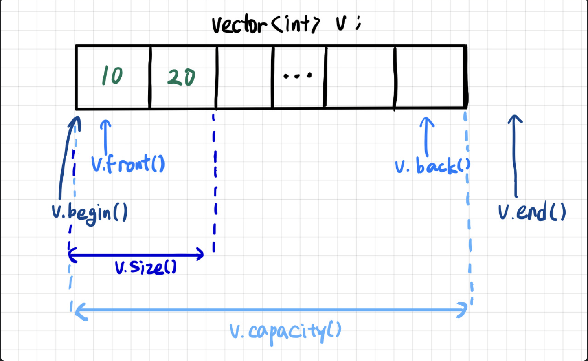
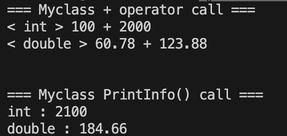

<!-- ---
marp: true
--- -->


# C++_Basic_Week_07

_작성자 : 황선웅_

---


## 과제 리뷰


---

### 동적 할당

C++에서 동적 할당을 위해선, `new`와 `delete`를 사용할 수 있습니다.   


```cpp
int* p = new int;
```

`new` 메모리를 할당하고, **할당된 메모리의 주소** 를 반환합니다. 

---

```cpp
delete p;
```

`delete`를 이용하여 `new` 로 할당된 메모리를 해제 할 수 있습니다.   

---

### 살펴봅시다

```cpp
class IntArray {
private:
    int* arr;
    int size;

public:
    IntArray( int size ) : size( size ) 
    {
        arr = new int[ size ] ; 
    }

    ~IntArray() 
    {
        delete[] arr ; 
    }
};
```

[new, delete](https://learn.microsoft.com/ko-kr/cpp/cpp/new-and-delete-operators?view=msvc-170)

---

### vector

`vector`는 STL의 컨테이너 클래스로, **크기가 가변적인 배열** 입니다!   
    
런타임 도중에 요소의 추가나 삭제가 가능하며, 자동으로 메모리를 관리해줍니다.    

---

<!-- <p align="center">
</img>
<br>벡터의 구조
</p> -->


---

1. 런타임 도중 요소를 **추가하거나 제거** 할 수 있습니다.
2. 배열처럼 **인덱스를 사용하여 요소에 빠르게 접근** 할 수 있습니다.
3. 내부적으로 데이터를 **연속된 메모리 공간** 에 저장합니다. 
4. 요소를 추가하거나 제거할 때 **자동으로 메모리를 할당하거나 해제** 합니다.
   
---

<br>

```cpp
#include <vector>

// 벡터 생성
std::vector<int> vec; // 빈 벡터
std::vector<int> vec2(5); // 크기가 5이고 모든 요소가 0인 벡터
std::vector<int> vec3(5, 1); // 크기가 5이고 모든 요소가 1인 벡터

// 요소 추가
vec.push_back(1); // 벡터 끝에 요소 추가

// 요소 접근
int first = vec[0]; // 인덱스로 접근
int first2 = vec.at(0); // at 함수로 접근
int last = vec.back(); // 마지막 요소 접근

// 요소 제거
vec.pop_back(); // 벡터 끝의 요소 제거

// 크기 및 용량
int size = vec.size(); // 벡터 크기 반환
int capacity = vec.capacity(); // 벡터 용량 반환

```

---


벡터는 동적 배열이기 때문에 크기가 가변적이지만, 요소를 추가하면서 벡터의 용량( capacity )을 초과하면, 벡터는 자동으로 더 큰 메모리를 할당하고 모든 요소를 새 메모리로 복사합니다.    


```cpp
std::vector<int> vec; 
vec.reserve(1000);
```

위와 같이 `reserve` 를 이용하여 미리 벡터의 크기를 지정해줄 수 있습니다.

[벡터 정리 블로그](https://dense.tistory.com/entry/cpp-stl-vector)   
[벡터 정리 공식문서](https://learn.microsoft.com/ko-kr/cpp/standard-library/vector-class?view=msvc-170)   

---

## 오버로딩과 오버라이딩

### 오버로딩

**함수 중복 정의**   
같은 이름의 함수에 매개변수를 다르게 사용하여 매개변수에 따라 다른 함수가 실행되는 것.   

---

```cpp
void add( int a, int b )
{
    std::cout << "두 정수의 합 : " << a + b << std::endl ;
}

void add( double a, double b )
{
    std::cout << "두 실수의 합 : " << a + b << std::endl ;
}
```
---

- 멤버 함수( 메소드 ) 이름이 같아야 합니다.
- 반환값이 같아도 되고 달라도 됩니다.
- 매개변수의 개수가 달라야한다.
- 매개변수의 개수가 동일한 경우, 자료형이 달라야 합니다.

---

### 오버라이딩

**함수 재정의**   
상속 받았을때 부모 클래스의 함수를 사용하지 않고, 다른 기능을 실행할때 함수를 자식 클래스에 같은 이름, 매개변수로 재정의해서 사용하는 것.


---

```cpp
class Parent
{
    public:
    void add( int a )
    {
        std::cout << a + a << std::endl ;
    }
}

class Child : public Parent
{
    public:
    void add( int a )
    {
        std::cout << a + a + a << std::endl ;
    }
}

int main()
{
    Parent A ;
    Child B ;

    A.add( 100 ) ;
    B.add( 100 ) ;
}
```

---

- 오버라이드 하고자 하는 멤버함수( 메소드 )가 상위 클래스에 존재해야합니다.
- 멤버함수( 메소드 ) 이름이 같아야 합니다.
- 멤버함수( 메소드 )의 매개변수 개수, 자료형이 동일해야 합니다.
- 멤버함수( 메소드 )의 반환값의 자료형이 같아야 합니다.
- 상위 메소드와 동일하거나, 새로운 내용이 추가되어야 합니다.

---

## 연산자 오버로딩

그럼 연산자 오버로딩은 뭘까요?

---

```cpp
class Human
{
    public:
    std::string m_name ;
    int m_age ;

    Human( std::string t_name, int t_age ) : m_name( t_name ), m_age( t_age ) {} 

    void ShowInfo()
    {
        std::cout << "name : " << this->m_name << ", age : " << this->m_age ;
    }
    Human operator+( Human &t_human )
    {
        std::cout << "Add two humans" << std::endl ;

        return Human( this->m_name + t_human.m_name , this->m_age + t_human.m_age ) ;
    }
}
```

`+` 연산자를 오버로딩해 `Human` 객체 끼리의 `+` 연산이 가능하게 할 수 있습니다.   

---

## 실습해보기

```cpp
class MyClass
{
	private:
	int m_int ;
	double m_double ;

	public:
	MyClass( int t_int, double t_double ) : m_int( t_int ), m_double( t_double ) {}
	void PrintInfo() 
	{
		std::cout << "\n\n=== Myclass PrintInfo() call ===" << std::endl ;
		std::cout << "int : " << this->m_int << std::endl ;
		std::cout << "double : " << this->m_double << std::endl ;
	}
	MyClass operator+( MyClass& ) ;
} ;
```
아래의 출력결과가 나오도록 `MyClass`의 `+`연산자를 오버로딩하는 코드를 작성해주세요.

---



<!-- <p align="center">
</img>
<br>출력결과
</p> -->

---

## auto, friend 키워드

### auto 키워드

C++에서 `auto` 키워드는 컴파일러가 자동으로 변수의 타입을 추론하도록 합니다.   

```cpp
auto i = 0; // i는 int 타입이 됩니다.
int i = 0; // 명시적으로 int 타입을 선언했습니다.
```

---

사용 예시는 다음과 같습니다.

```cpp
// 벡터 반복
for(int i = 0; i < vec.size(); ++i) {
    std::cout << vec[i] << ' ';
}
for(auto it = vec.begin(); it != vec.end(); ++it) {
    std::cout << *it << ' ';
}
for(auto& elem : vec) {
    std::cout << elem << ' ';
}
```

---

### friend 키워드 

`friend` 키워드는 **클래스 또는 함수에 대한 접근 권한** 을 부여하는 데 사용됩니다.

<!-- <p align="center">
</img>
<br>비슷합니다
</p> -->

```cpp
class MyClass {
private:
    int secret = 42 ;

public:
    friend void revealSecret( MyClass& mc ) ;
};

void revealSecret( MyClass& mc ) {
    std::cout << "The secret is " << mc.secret << std::endl ; // friend 함수는 private 멤버에 접근 가능
}

int main() {
    MyClass mc ;
    revealSecret( mc ) ; 
    return 0 ;
}
```

`MyClass`의 `friends`로 선언 된 `void revealSecret( MyClass& mc )`함수는 `MyClass`의 `private`, `protected`에 접근할 수 있습니다.

---

<!-- ## 과제

1. `<<`, `>>` 오버로딩 -->