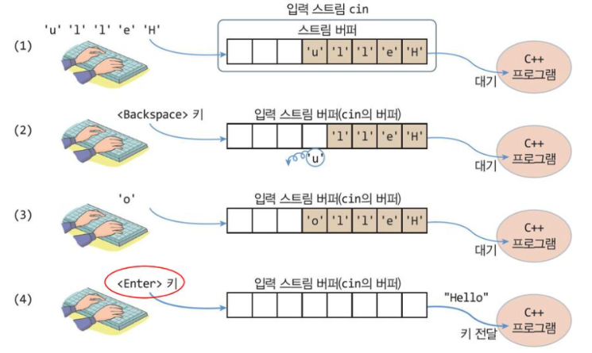
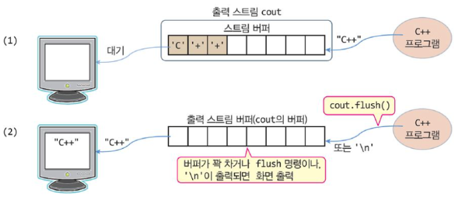
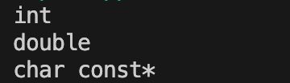

<!-- ---
marp: true
--- -->


# C++_Basic_Week_08

_작성자 : 황선웅_

---

## 과제 리뷰

---


```cpp
/////// ( 1 ) ///////
week07::Human::Human( int t_age, std::string t_name ) : m_age( t_age ), m_name( t_name ) {} ;
/////////////////////
```

---

```cpp

/////// ( 2 ) ///////
week07::Human week07::Human::operator+( Human& t_human )
{
	std::cout << "\n========== + 연산자 호출 ==========" << std::endl ;	
	std::cout << "Name : " << this->m_name << " or " << t_human.m_name << std::endl ;	
	std::cout << "Age : " << this->m_age << " + " << t_human.m_age << std::endl ;	

	int tempAge ;
	std::string tempName ;

	tempAge = this->m_age + t_human.m_age ;

	tempName = ( tolower( this->m_name[0] ) < tolower( t_human.m_name[0]) ) ? this->m_name : t_human.m_name ; 

	return Human( tempAge , tempName ) ;
} ;
/////////////////////

````
---

```cpp

/////// ( 3 ) ///////
std::ostream& week07::operator<<( std::ostream& os , const week07::Human& t_human )
{
	os << "Name : " << t_human.m_name << ", Age : " << t_human.m_age ;
	return os ;
} ;
/////////////////////

```

---

```cpp

/////// ( 4 ) ///////
std::istream& week07::operator>>( std::istream& is , week07::Human& t_human )
{
	std::cout << "이름, 나이 입력 ( 띄어쓰기 구분 ) " << std::endl ;	
	is >> t_human.m_name >> t_human.m_age ;
	return is ;
} ;
/////////////////////
```


---

### 알파벳 소문자 검사

```cpp
tempName = ( tolower( this->m_name[0] ) < tolower( t_human.m_name[0]) ) ? this->m_name : t_human.m_name ; 
```
<!-- 왜 std::ostream&에는 week07을 붙이면 오류가 나는데 operator에는 week07::을 붙여야 오류가 나지 않는지...?

일단 operator함수가 week07 네임스페이스에는 속하지만 Human클래스에는 속하지 않기 때문인가 라고 생각하는 중

//질문: 연산자 오버로딩의 전체적인 프로세스를 잘 모르겠다(특히 입출력 연산자 오버로딩에서 왜 매개변수가 저렇게 되어야 하는지 모르겠다)
//알파벳 순서가 빠른 이름을 대소문자 구분하지 않고 비교하게 하기 위해서 소문자로 다 바꿔서 비교하는 방법을 선택했는데
//다른 방법이 있을지 궁금하다. -->

---

### >>, << 연산자 오버로딩

---

#### 1. 입출력이 되는 원리

`스트림`은 일련의 데이터나 데이터의 흐름을 뜻함   

+ 입력
  - 키보드 입력 -> 입력 스트림 -> 프로그램
  


---

+ 출력
  - 프로그램 -> 출력 스트림 -> 출력



---

#### 2. 기존 std::cout, std::cin의 작동 방식

표준 출력 스트림인 `std::cout`**객체** 에 출력내용이 전달 되면 출력.

표준 입력은 `std::cin`**객체** 에 입력 내용이 전달되면, 프로그램에 전달.

<!-- [cout 출력 포맷 설정](https://repilria.tistory.com/243) -->

---

#### 3. 오버로딩하면 어떻게 작동하나 ?
   
<br>

연산자 오버로딩의 2가지 종류

1. 클래스의 멤버함수로 오버로딩
   ```cpp
    a.operator+(a);
   ```
2. 외부함수의 ``friend``선언으로 오버로딩
   ```cpp
    operator+(a, a);
   ```

---

```cpp
std::ostream& week07::operator<<( std::ostream& os , const week07::Human& t_human )
{
	os << "Name : " << t_human.m_name << ", Age : " << t_human.m_age ;
	return os ;
} ;
```
위와 같이 오버로딩 된 함수를 `std::cout << C ;`로 호출하는 것은,

```cpp
operator<<( std::cout , C )
```
와 같은 매개변수로 함수 호출한 것과 동일합니다.   

---

**통상적으로**
자기 자신을 리턴하지 않는 이항 연산자들, _( +, -, *, / )_ 들은 모두 외부 함수로 선언하는 것이 원칙   

<br>

반대로 자기 자신을 리턴하는 이항 연산자들, *( +=, -= )* 들은 모두 멤버 함수로 선언하는 것이 원칙

---

### 네임스페이스 

- `std::ostream&`과 `operator`의 차이

```cpp
std::ostream& week07::operator<<( std::ostream& os , const week07::Human& t_human )
{
	os << "Name : " << t_human.m_name << ", Age : " << t_human.m_age ;
	return os ;
} ;
```

---

## 템플릿

```cpp
class Vector {
  std::string* data;
  int capacity;
  int length;

 public:
  // 생성자
  Vector(int n = 1) : data(new std::string[n]), capacity(n), length(0) {}

  // 맨 뒤에 새로운 원소를 추가한다.
  void push_back(std::string s) {
    if (capacity <= length) {
      std::string* temp = new std::string[capacity * 2];
      for (int i = 0; i < length; i++) {
        temp[i] = data[i];
      }

      delete[] data;
      data = temp;
      capacity *= 2;
    }

    data[length] = s;
    length++;
  }
```

---

```cpp
  // 임의의 위치의 원소에 접근한다.
  std::string operator[](int i) { return data[i]; }

  // x 번째 위치한 원소를 제거한다.
  void remove(int x) {
    for (int i = x + 1; i < length; i++) {
      data[i - 1] = data[i];
    }
    length--;
  }

  // 현재 벡터의 크기를 구한다.
  int size() { return length; }

  ~Vector() {
    if (data) {
      delete[] data;
    }
  }
};
```

위는 저번시간에 다룬 `vector` 클래스의 코드 입니다.   

---

```cpp
class Vector {
  char* data;
  int capacity;
  int length;

 public:
  // 생성자
  Vector(int n = 1) : data(new char[n]), capacity(n), length(0) {}

  // 맨 뒤에 새로운 원소를 추가한다.
  void push_back(char s) {
    if (capacity <= length) {
      char* temp = new char[capacity * 2];
      for (int i = 0; i < length; i++) {
        temp[i] = data[i];
      }
      delete[] data;
      data = temp;
      capacity *= 2;
    }

    data[length] = s;
    length++;
  }
```

---

```cpp
class Vector {
  T* data;
  int capacity;
  int length;

 public:
  // 생성자
  Vector(int n = 1) : data(new T[n]), capacity(n), length(0) {}

  // 맨 뒤에 새로운 원소를 추가한다.
  void push_back(T s) {
    if (capacity <= length) {
      T* temp = new T[capacity * 2];
      for (int i = 0; i < length; i++) {
        temp[i] = data[i];
      }
      delete[] data;
      data = temp;
      capacity *= 2;
    }

    data[length] = s;
    length++;
  }
```

---

```cpp
  // 임의의 위치의 원소에 접근한다.
  T operator[](int i) { return data[i]; }

  // x 번째 위치한 원소를 제거한다.
  void remove(int x) {
    for (int i = x + 1; i < length; i++) {
      data[i - 1] = data[i];
    }
    length--;
  }

  // 현재 벡터의 크기를 구한다.
  int size() { return length; }

  ~Vector() {
    if (data) {
      delete[] data;
    }
  }
};

```

---


**템플릿** 은 함수나 클래스를 개별적으로 *다시 정의하지 않아도, 다양한 자료형*으로 사용할 수 있도록 하게 만들어 놓은 **틀** 입니다.   

크게 2가지 종류가 있습니다.   

1. 클래스 템플릿
2. 함수 템플릿


<br>

---

### 함수 템플릿

---

코드로 살펴보겠습니다.   

```cpp
int add( int a, int b )
{
    return a + b ;
}

double add( double a, double b )
{
    return a + b ;
}
```

두 `add`는 매개변수로 받은 두 숫자를 더해서 반환하는 **동일한 동작을 하는** 함수입니다.   
하지만, 반환값의 자료형과 매개변수의 자료형이 다르기 때문에 `함수 오버로딩`으로 2번 정의했습니다.   

---

하지만 함수 템플릿을 사용하면, 이렇게 작성할 수 있습니다.   

```cpp
template <typename MyTemplate>
MyTemplate add( MyTemplate a, MyTemplate b )
{
    return a + b ;
}
```

---

### 실습해보기

매개변수의 타입을 출력하는 함수 `printInfo` 함수를 정의해봅시다.   
변수의 타입은 `typeid( 변수 ).name()`을 통해 출력할 수 있습니다.   
```cpp
std::cout << typeid( 변수 ).name() << std::endl ;
```

<br>


*출력 결과*

---

## 클래스 템플릿

---

클래스에선 이런 템플릿을 더 효과적으로 사용할 수 있습니다.   

```cpp
template<typename T>
class Box {
    T content;

public:
    Box(const T& content) : content(content) {}
    const T& get() const { return content; }
};
```

---

## 템플릿 특수화

---

템플릿으로 다양한 자료형을 다룰수 있지만,
특정 자료형에선 다르게 동작하게 구현하기 위해선 `템플릿 특수화`라는 개념을 이해해야합니다.

```cpp
template<>
class Box<int> {
    int content;

public:
    Box(const int& content) : content(content) {}

    const int& get() const { return content; }

    void countUp()
    {
        for( int i = 0; i < content; i++ ){ std::cout << i << std::endl ; }
    }

};
```

[템플릿 특수화](https://learn.microsoft.com/ko-kr/cpp/cpp/template-specialization-cpp?view=msvc-170)

---

## 당부드리고 싶은 말

---

1. 빼먹은거 엄~~~ 청 ~~~ 많다
2. 틀린것도..?
3. 오래 쉬면 까먹는다...

<br>


---

+ [C++ 설명서](https://learn.microsoft.com/ko-kr/cpp/cpp/?view=msvc-170)

+ [모두의 코드 C++](https://modoocode.com/category/C++)