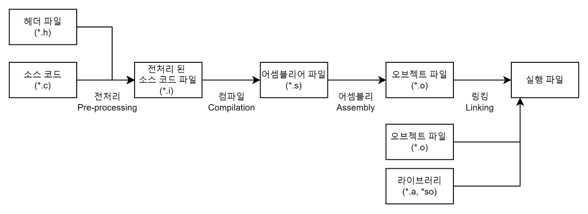

# C++_Basic_Week_01

_작성자 : 황선웅_


> _C++ 를 신청해주셔서 감사합니다.<br>이번 주에는 스터디 진행 방향과 C언어와 C++의 다른점에 대해 알아봅시다!_

---
#### Hello World!
```cpp
// helloworld.cpp
#include <iostream>

int main( void )
{
    std:cout << "Hello World!" << std:endl;
    return 0;
}
```
**위 코드에선 4가지를 살펴볼 수 있습니다.**
1. 주석
2. 전처리 지시자
3. main( ) 함수
4. I/O 스트림
<br>

    ##### 주석
    주석은 프로그래머에게만 유용한 메세지로, **컴파일러는 이를 처리하지 않습니다.**
     ```cpp
    // helloworld.cpp 
    ```
    위와 같이 슬래쉬 2개를 작성해 주석을 작성 할 수 있습니다.
    ```cpp
    /* 여러 줄 주석의 예.
        컴파일러는 이 부분을 완전히 무시한다.
    */
    ```
    여러 줄 주석의 주석을 작성할땐 위와 같이 `/* */`를 사용할 수 있습니다.
<br>
    ##### 전처리 지시자
    
    <br>

    
    *Process of compile*
    <br>
    
   주석은 빌드 작업의 4단계 _( 전처리 - 컴파일 -  어셈블 - 링킹 )_ 중 전처리 과정에서 처리됩니다. 
    ```cpp
    #include <iostream>
    ```
   **#** 문자로 시작하는 구문을 **지시자( directive )** 라고 하며 전처리기에 전달할 사항을 표현합니다. `#include`위 코드의 지시자는 `<iostream>`헤더 파일에 있는 내용을 현재 파일에서 사용할 수 있게 모두 가져오도록 전처리기에 지시합니다. 헤더 파일은 주로 나중에 소스 파일에서 구현할 함수를 선언하는 용도로 사용됩니다. 이러한 함수 **선언부( declaration )** 는 함수의 호출 방식, 매개변수의 개수와 타입, 리턴 타입 등만 컴파일러에 알려주고, 그 함수가 실제로 수행할 동작은 **구현부( definition )** 에 작성합니다.
<br>
   **\<iostream>** 헤더 파일엔 C++에서 제공하는 입력 및 출력 메커니즘이 선언되어 있습니다. 자세한 내용은 [C++ iostream](https://learn.microsoft.com/ko-kr/cpp/standard-library/iostream?view=msvc-170 "C++ iostream") 를 확인해주세요!
<br>

   ##### main( ) 함수
   프로그램은 항상 `main( )`함수에서 시작합니다!

   `main( )`함수는 프로그램의 실행 결과에 대한 상태인 `int`타입의 값을 리턴합니다. 따로 리턴 문장을 정리하지 않으면 자동으로 0을 리턴합니다.
   ```cpp
   int main( int argc, char* argv[] )
   ```
   `main( )`함수는 매개변수를 받지 않거나, 위와 같이 두 매개변수를 받도록 작성할 수 있습니다. `argc`는 프로그램에 전달 할 인수 개수를 지정하고, `argv`는 전달할 인수의 값을 담습니다.
   [main 함수의 인수 관련 문서](https://learn.microsoft.com/ko-kr/cpp/cpp/main-function-command-line-args?view=msvc-170 "C++ iostream")
<br>

   ##### I/O 스트림
   ```cpp
    std:cout << "Hello World!" << std:endl;
   ``` 
   추 후 자세히 다루지만, 입력과 출력에 대한 기본 원리는 간단합니다. 컨베이어 벨트를 생각하시면 쉬운데요! 성격에 맞는 컨베이어 벨트에 데이터를 올려두기만 하면 그대로 출력됩니다.
   예를 들어 **`std::cout`** 이라는 컨베이어 벨트는 **사용자 콘솔( Standard output )** 에 출력합니다. _( 다른 예시로 `std::cerr`컨베이어 벨트는 에러 콘솔에 출력합니다. )_
   <br>
    ```cpp
    std:cout << "I slept " << 8 << "hours" << std:endl;
   ``` 
   데이터를 컨베이어 벨트에 올리는 작업은 **<<** 연산자로 표현합니다. 위 코드와 같이 다양한 타입의 데이터를 출력 스트림으로 보낼수도 있습니다.
   **`std::endl`** 은 문장이 끝났다는 것을 의미합니다. 출력 스트림에서 **`std::endl`** 이 나타나면 지금까지 전달한 내용을 모두 출력하고 다음 줄로 넘어갑니다.

   <br>

   스트림을 이용해서 사용자의 입력도 받을 수 있는데, 가장 간단한 방법으로 **`std::cin`** 이 있습니다.

   ```cpp
   int value;
   std::cin >> value ;
   ```
   사용자가 어떤 종류의 값을 입력할지 알 수 없기 떄문에, 사용자 입력을 처리하는 방법은 다소 까다롭습니다. 하지만 C에서 사용하던 **`printf()`** 나 **`scanf()`** 를 사용하는건 지양해주세요. **타입 안전성** 을 보장하지 않기 때문입니다! 
   [Stream 관련 정리 블로그](https://velog.io/@jinh2352/스트림stream "C++ stream")

   [printf()와 cout의 차이 블로그](https://blog.naver.com/view7186/222083168651 "C++ stream")
<br>

#### 실습해보기 🧐

   이름을 입력하면 콘솔에 ***"나는 @@@ 입니다.~"*** 를 출력하는 코드를 짜보세요.

   ```cpp
   // 출력 예시
   나는 황선웅입니다.
   안녕하세요?
   ``` 

---

#### 네임스페이스

**네임스페이스** 는 코드에서 이름이 서로 충돌하는 문제를 해결하기 위해 나온 개념입니다. 예를들어, `foo()`함수를 정의해서 코드를 작성하다가 외부 라이브러리가 필요해서 추가했더니 기존 코드에도 `foo()`함수가 있을 수 있습니다. 이 경우에 두 `foo()`들을 구분하기 위해 네임스페이스를 사용합니다.


<details>
<summary>네임스페이스 예제</summary>
<div markdown="1">       

```cpp
#include <iostream>

namespace mycode 
{
    void foo();
}

void mycode::foo()
{
    std::cout << "foo() from namespace \"mycode\"\n" << std::endl ;
}

namespace yourcode 
{
    void foo();
}
void yourcode::foo()
{
    std::cout << "foo() from namespace \"yourcode\"\n" << std::endl ;
}

int main(){
    mycode::foo();
    yourcode::foo();
}
```
</div>
</details>
<br>

위 예제는 각각 **`mycode`**,**`yourcode`** **`foo()`** 함수를 정의하고, 호출 합니다. _( 이 예제는 이해를 돕기위한 예제입니다. 코딩하실땐 위와 같은 구조로 작성하는건 지양해주세요. )_ 

```cpp
using namespace std;
```

또한 매번 네임스페이스를 작성하지 않아도, 한번에 **_"나는 std라는 네임스페이스 안의 함수들만 사용할거다!"_** 라고 명시할 수 있습니다.

> <br>_다만 이 방법은 권장드리지 않습니다. 왜냐하면 std 에 이름이 겹치는 함수를 만들게 된다면, 오류가 발생하기 때문입니다. 게다가 C++ 표준 라이브러리는 매우 매우 거대하므로, 정말 수 많은 함수들이 존재하고 있습니다. 자칫 잘못하다가 이름을 겹치게 사용한다면, 고치느라 시간을 많이 잡아먹을 것입니다. 추가로 std 에는 매번 수 많은 함수들이 새롭게 추가되고 있기 때문에 C++ 버전이 바뀔 때 마다 기존에 잘 작동하던 코드가 이름 충돌로 인해 동작하지 않게되는 문제가 발생할 수 있습니다. 따라서 권장하는 방식은 **`using namespace std;`** 같은 것은 사용하지 않고, **`std::`** 를 직접 앞에 붙여 **`std`** 라는 네임스페이스의 함수이다 라고 명시해주는 것이 좋습니다._
<br>

네임스페이스 안에 네임스페이스가 있는 **중첩 네임스페이스** 라는게 있습니다. 
```cpp
namespace MyLibraries
{
    namespace Networking
    {
        namespace FTP
        {
            /* .... */
        } 
    }
} 

// C++17부터는 아래와 같은 형으로도 사용 가능합니다.
namespace MyLibraries::Networking::FTP
{
    /* ... */
}
```
와 같이 **중첩된 네임스페이스** 를 사용 할 수 있습니다.
<br>

```cpp
namespace MyFTP = MyLibraries::Networking::FTP ;
```
위와 같이 **네임스페이스 앨리어스( namespace alias )** 를 이용하여 네임스페이스의 이름을 다르게 표현하거나 기존 이름을 좀 더 짧게 만들수도 있습니다.

#### 실습해보기 🤔
```cpp
std::cout << "hi" << std::endl
<< "my name is "
<< "Psi" << std::endl;
```
위 코드를 실행하면 어떻게 출력될까요?

---
#### 리터럴
**리터럴( literal )** 은 코드에 표시한 숫자나 스트링과 같은 값을 의미합니다.
C++은 다양한 표준 리터럴을 제공하는데, 숫자는 다음과 같은 리터럴로 표현이 가능합니다.

- 10진수 리터럴, 123
- 8진수 리터럴, 0173
- 16진수 리터럴, 0x7B
- 2진수 리터럴, 0b1111011

또한 C++에서는 다음과 같은 리터럴도 지원합니다.

- 부동소수점 값 _( ex : 3.14f )_
- 배정도 부동소수점 _( ex : 3.14 )_
- 단일 문자 _( ex : 'a' )_
- '0'으로 끝나는 문자 배열 _( ex : "character array" )_

코드의 가독성을 높이기 위해서 **작은따옴표( ' )** 를 이용해 자리수 구분도 할 수 있습니다.
```cpp
23'222'112
0.124'443f
```
---

#### 변수

**C++** 에서 **변수** 는 코드 안 어디에서나 선언할 수 있습니다. C언어와 동일하게 **변수의 선언과 동시에 초깃값을 대입하는 기능을 제공합니다.**
```cpp
int uninitializedInt ;
int initializedInt = 7 ;
```

C언어와 다르게 C++에는 **`std::byte`** 타입이 존재합니다. 
C++17부터 등장한 **byte** 자료형은 기존 char이나 unsigned char로 표현하던 방식과는 달리 명확히 메모리의 한 byte라는걸 명시할 수 있습니다.
```cpp
std::byte b{42} ; // 사용 예
```
_나머지 자료형들은 C랑 똑같아요..._
[C++ 자료형 문서](https://learn.microsoft.com/ko-kr/cpp/cpp/data-type-ranges?view=msvc-170)


변수 타입을 실행 중에 변경할 수 있는 **타입 캐스팅 ( 동적 형변환, 캐스팅 )** 도 중요합니다. 

```cpp
float myFloat = 3.14f ;
int i1 = ( int )myFloat ;
int i2 = int( myFloat ) ;
int i3 = static_cast< int >( myFloat ) ; 
```
---

#### 연산자

[C++ 연산자 문서](https://learn.microsoft.com/ko-kr/cpp/cpp/cpp-built-in-operators-precedence-and-associativi서y?view=msvc-170)
_C랑 동일합니다 ?_

다만, 연산자 우선순위를 잘 몰라도 코드를 쉽게 이해할 수 있도록, **소괄호를 통해 표현식을 작은 단위로 묶어서 표현**하는걸 추천드립니다.

```cpp
int i = 34 + 8 * 2 + 21 / 7 % 2 ;
int i = 34 + ( 8 * 2 ) + (( 21 / 7 ) % 2 ) ;
```

---

#### 타입

**C++** 에서는 기본 타입 _( int, bool등을 )_ 조합해서 좀 더 복잡한 타입을 정의할 수 있습니다.

---

#### 재미있게 C++을 공부하는 방법이 없을까 🤔 ?
<br>
